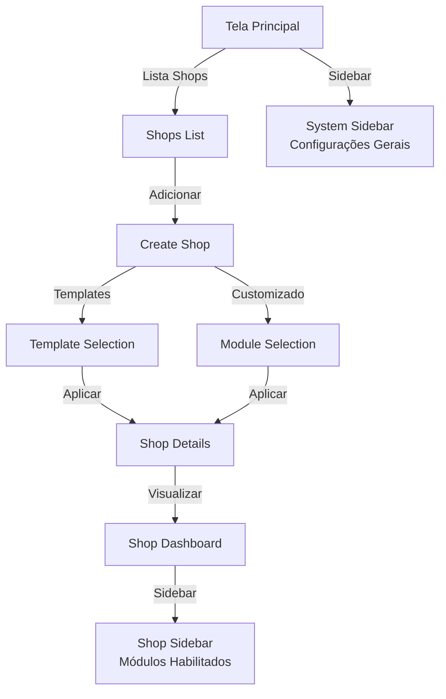
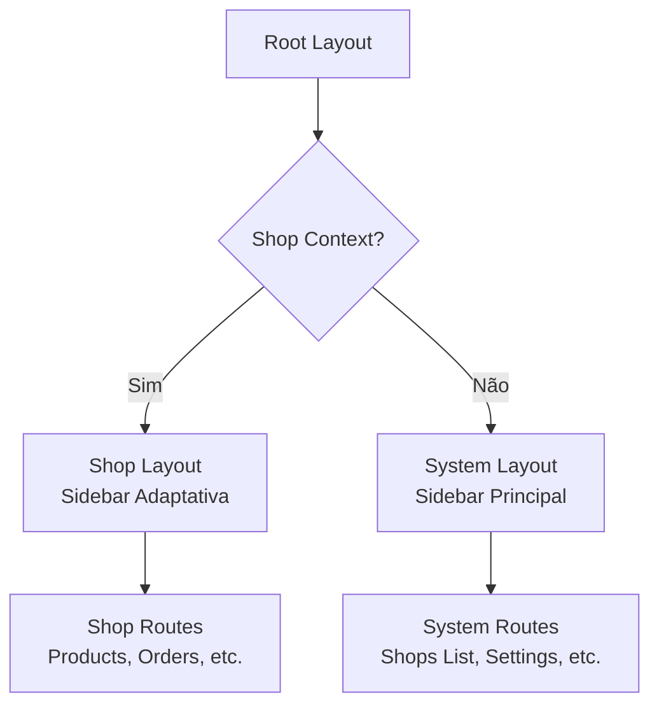
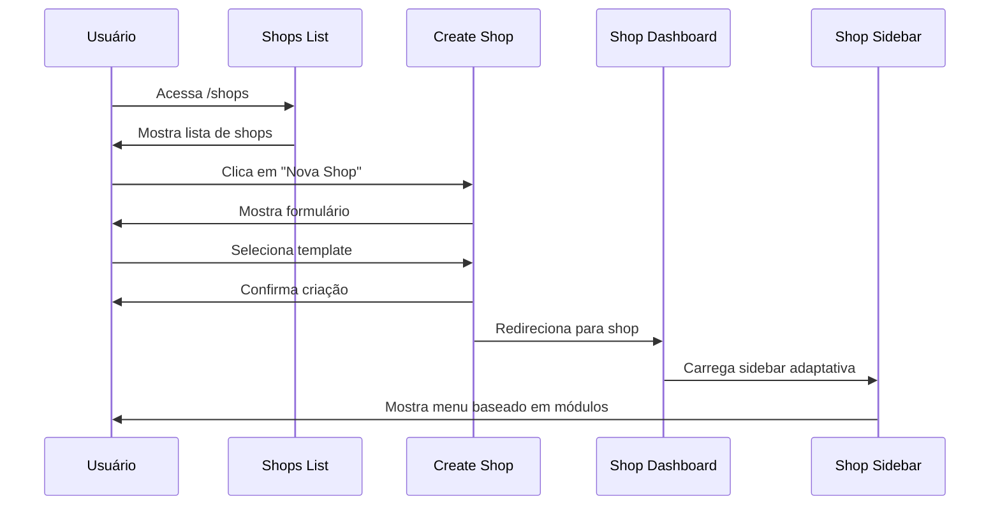

# Plano de Desenvolvimento: Frontend - Sistema de Shops e Módulos

Este documento descreve o plano completo de desenvolvimento do frontend para implementar o gerenciamento de shops, templates e módulos com interface adaptativa.

---

## 📋 Índice

1. [Visão Geral](#visão-geral)
2. [Situação Atual](#situação-atual)
3. [Objetivos e Requisitos](#objetivos-e-requisitos)
4. [Arquitetura da Interface](#arquitetura-da-interface)
5. [Estrutura de Rotas](#estrutura-de-rotas)
6. [Componentes Principais](#componentes-principais)
7. [Estado e Gerenciamento](#estado-e-gerenciamento)
8. [Plano de Implementação](#plano-de-implementação)
9. [Design e UX](#design-e-ux)
10. [Testes e Validação](#testes-e-validação)

---

## Visão Geral

### Contexto

Atualmente, o sistema visualiza apenas um shop padrão. Este plano implementa:

- **Interface multi-shop**: Lista de shops com navegação entre elas
- **Criação de shops com templates**: Interface para criar shops usando templates pré-configurados
- **Criação customizada**: Seleção manual de módulos para shops personalizadas
- **Sidebar adaptativa**: Sidebar que se adapta aos módulos habilitados por shop
- **Sidebar principal**: Sidebar para configurações gerais do sistema (fora do contexto de shop)

### Fluxo Principal



---

## Situação Atual

### Estado Atual do Frontend

- ✅ Sistema funcional com visualização de um shop padrão
- ✅ Sidebar atual organizada por domínio/funcionalidade
- ✅ Rotas para diferentes entidades (products, orders, customers, etc.)
- ✅ Componentes de tabelas e formulários funcionais
- ❌ Não há gerenciamento de múltiplas shops
- ❌ Não há seleção de templates na criação
- ❌ Sidebar não se adapta aos módulos habilitados
- ❌ Não há sidebar para configurações gerais

### Estrutura Atual de Rotas

```
/
├── /products
├── /orders
├── /customers
├── /inventory
├── /settings
└── ...
```

---

## Objetivos e Requisitos

### Objetivos Principais

1. **Gerenciamento de Shops**:
   - Listar todas as shops disponíveis
   - Criar novas shops usando templates ou customizado
   - Visualizar e editar shops existentes
   - Selecionar shop ativa para trabalhar

2. **Interface Adaptativa**:
   - Sidebar que mostra apenas módulos habilitados
   - Organização por categorias/domínios
   - Navegação intuitiva entre shops

3. **Experiência do Usuário**:
   - Interface clara e intuitiva
   - Feedback visual adequado
   - Transições suaves entre shops

### Requisitos Funcionais

1. **RF1**: Exibir lista de shops na página principal
2. **RF2**: Permitir criação de shop via template pré-configurado
3. **RF3**: Permitir criação de shop customizada selecionando módulos
4. **RF4**: Sidebar adaptativa baseada em módulos habilitados da shop ativa
5. **RF5**: Sidebar principal para configurações gerais (fora do contexto de shop)
6. **RF6**: Indicador visual da shop ativa
7. **RF7**: Navegação entre shops sem perder contexto

### Requisitos Não Funcionais

1. **RNF1**: Performance: Carregamento rápido de shops e módulos
2. **RNF2**: UX: Interface intuitiva e responsiva
3. **RNF3**: Manutenibilidade: Código modular e reutilizável
4. **RNF4**: Acessibilidade: Seguir padrões WCAG

---

## Arquitetura da Interface

### Hierarquia de Layouts



### Estrutura de Componentes

```
src/
├── components/
│   ├── layouts/
│   │   ├── root-layout.tsx          # Layout raiz
│   │   ├── shop-layout.tsx          # Layout com sidebar de shop
│   │   └── system-layout.tsx        # Layout com sidebar principal
│   ├── sidebars/
│   │   ├── shop-sidebar.tsx         # Sidebar adaptativa por shop
│   │   ├── system-sidebar.tsx       # Sidebar de configurações gerais
│   │   └── sidebar-item.tsx         # Item de menu da sidebar
│   ├── shops/
│   │   ├── shops-list.tsx           # Lista de shops
│   │   ├── shop-card.tsx            # Card de shop
│   │   ├── create-shop-form.tsx     # Formulário de criação
│   │   ├── template-selector.tsx    # Seleção de templates
│   │   ├── module-selector.tsx      # Seleção de módulos
│   │   └── shop-switcher.tsx        # Seletor de shop ativa
│   └── ui/                          # Componentes UI existentes
├── hooks/
│   ├── use-shop.ts                  # Hook para shop ativa
│   ├── use-module-enabled.ts        # ✅ Já implementado
│   └── use-shops.ts                 # Hook para lista de shops
├── stores/
│   └── shop-store.ts                # Estado global de shop
└── routes/
    ├── __root.tsx                   # Rota raiz
    ├── shops/
    │   ├── index.tsx                # Lista de shops
    │   ├── new.tsx                  # Criar shop
    │   ├── $shopId/
    │   │   └── index.tsx            # Dashboard da shop
    │   └── $shopId/
    │       └── [shop-routes]        # Rotas dentro do contexto da shop
    └── settings/                    # Configurações gerais
```

---

## Estrutura de Rotas

### Nova Estrutura de Rotas

```
/
├── /shops                           # Lista de shops (System Layout)
│   ├── /new                         # Criar shop (System Layout)
│   └── /$shopId                     # Shop específica (Shop Layout)
│       ├── /                        # Dashboard da shop
│       ├── /products                # Products (se módulo habilitado)
│       ├── /orders                  # Orders (se módulo habilitado)
│       ├── /customers               # Customers (se módulo habilitado)
│       ├── /inventory               # Inventory (se módulo habilitado)
│       ├── /shipping                # Shipping (se módulo habilitado)
│       ├── /checkout                # Checkout (se módulo habilitado)
│       ├── /pos                     # POS (se módulo habilitado)
│       ├── /reviews                 # Reviews (se módulo habilitado)
│       ├── /inquiries               # Inquiries (se módulo habilitado)
│       ├── /analytics               # Analytics (sempre disponível)
│       └── /settings                # Configurações da shop
├── /settings                        # Configurações gerais (System Layout)
│   ├── /general                     # Configurações gerais
│   ├── /modules                     # Gerenciar módulos
│   └── /templates                   # Gerenciar templates
└── /                                # Redireciona para /shops
```

### Rotas Protegidas por Módulo

Cada rota dentro de `/$shopId` deve verificar se o módulo correspondente está habilitado:

```typescript
// Exemplo: /shops/$shopId/inventory
const InventoryRoute = () => {
  const { shop } = useShop()
  const isInventoryEnabled = useModuleEnabled('inventory', shop?.features_config)
  
  if (!isInventoryEnabled) {
    return <ModuleNotEnabled module="inventory" />
  }
  
  return <InventoryTable />
}
```

---

## Componentes Principais

### 1. ShopsList Component

**Localização**: `src/routes/shops/index.tsx`

**Responsabilidades**:
- Listar todas as shops
- Mostrar shop padrão/ativa
- Permitir navegação para shop
- Botão para criar nova shop

**Props**:
```typescript
interface ShopsListProps {
  shops: Shop[]
  activeShopId?: string
  onSelectShop: (shopId: string) => void
  onCreateShop: () => void
}
```

### 2. ShopCard Component

**Localização**: `src/components/shops/shop-card.tsx`

**Responsabilidades**:
- Exibir informações da shop (nome, slug, status)
- Indicar shop ativa
- Mostrar módulos principais habilitados
- Ações: editar, deletar, ativar

**Props**:
```typescript
interface ShopCardProps {
  shop: Shop
  isActive: boolean
  onSelect: () => void
  onEdit: () => void
  onDelete: () => void
}
```

### 3. CreateShopForm Component

**Localização**: `src/routes/shops/new.tsx`

**Responsabilidades**:
- Formulário de criação de shop
- Seleção de template ou modo customizado
- Validação de dados
- Submissão para backend

**Estados**:
- Modo: 'template' | 'custom'
- Template selecionado (se modo template)
- Módulos selecionados (se modo custom)

### 4. TemplateSelector Component

**Localização**: `src/components/shops/template-selector.tsx`

**Responsabilidades**:
- Exibir cards de templates disponíveis
- Mostrar descrição e módulos incluídos
- Seleção visual de template
- Preview da configuração

**Props**:
```typescript
interface TemplateSelectorProps {
  templates: ShopTemplate[]
  selectedTemplate?: string
  onSelect: (templateCode: string) => void
}
```

### 5. ModuleSelector Component

**Localização**: `src/components/shops/module-selector.tsx`

**Responsabilidades**:
- Listar módulos disponíveis agrupados por categoria
- Checkboxes para seleção
- Mostrar dependências entre módulos
- Validação de seleção (core sempre selecionados)

**Props**:
```typescript
interface ModuleSelectorProps {
  modules: Module[]
  selectedModules: string[]
  onSelectionChange: (modules: string[]) => void
}
```

### 6. ShopSidebar Component

**Localização**: `src/components/sidebars/shop-sidebar.tsx`

**Responsabilidades**:
- Renderizar itens de menu baseados em módulos habilitados
- Agrupar por categorias/domínios
- Navegação dentro do contexto da shop
- Indicador de rota ativa

**Estrutura de Menu**:
```typescript
const menuStructure = {
  core: ['products', 'customers', 'orders', 'transactions', 'payments'],
  logistics: ['inventory', 'shipping', 'locations'],
  sales: ['checkout', 'pos'],
  marketing: ['reviews', 'inquiries'],
  analytics: ['analytics'] // Sempre disponível
}
```

### 7. SystemSidebar Component

**Localização**: `src/components/sidebars/system-sidebar.tsx`

**Responsabilidades**:
- Menu para configurações gerais
- Acesso à lista de shops
- Configurações do sistema
- Não depende de shop ativa

**Itens de Menu**:
- Home / Shops
- Settings
- Modules (gerenciar módulos)
- Templates (gerenciar templates)
- Users (se aplicável)

### 8. ShopSwitcher Component

**Localização**: `src/components/shops/shop-switcher.tsx`

**Responsabilidades**:
- Dropdown/combobox para trocar shop ativa
- Indicar shop atual
- Acesso rápido à lista de shops

---

## Estado e Gerenciamento

### Store de Shop (Zustand)

**Localização**: `src/stores/shop-store.ts`

```typescript
interface ShopState {
  shops: Shop[]
  activeShopId: string | null
  activeShop: Shop | null
  isLoading: boolean
  
  // Actions
  setActiveShop: (shopId: string) => Promise<void>
  loadShops: () => Promise<void>
  createShop: (data: CreateShopDTO) => Promise<Shop>
  updateShop: (id: string, data: UpdateShopDTO) => Promise<Shop>
  deleteShop: (id: string) => Promise<void>
}
```

### Hook useShop

**Localização**: `src/hooks/use-shop.ts`

```typescript
export function useShop() {
  const { activeShop, activeShopId, setActiveShop } = useShopStore()
  const isModuleEnabled = (moduleCode: string) => 
    useModuleEnabled(moduleCode, activeShop?.features_config, activeShop)
  
  return {
    shop: activeShop,
    shopId: activeShopId,
    setActiveShop,
    isModuleEnabled,
  }
}
```

### Hook useShops

**Localização**: `src/hooks/use-shops.ts`

```typescript
export function useShops() {
  const { shops, loadShops, createShop, updateShop, deleteShop } = useShopStore()
  
  useEffect(() => {
    loadShops()
  }, [])
  
  return {
    shops,
    loadShops,
    createShop,
    updateShop,
    deleteShop,
  }
}
```

---

## Plano de Implementação

### Fase 1: Estrutura Base (2-3 dias)

**Tarefas**:
1. ✅ Criar store de shop (Zustand)
2. ✅ Criar hooks `useShop` e `useShops`
3. ✅ Criar layouts: `SystemLayout` e `ShopLayout`
4. ✅ Atualizar estrutura de rotas
5. ✅ Criar repository para shops no frontend

**Entregáveis**:
- Store funcionando
- Hooks implementados
- Layouts base criados
- Rotas estruturadas

### Fase 2: Lista de Shops (2-3 dias)

**Tarefas**:
1. ✅ Criar componente `ShopsList`
2. ✅ Criar componente `ShopCard`
3. ✅ Implementar rota `/shops`
4. ✅ Integrar com backend para listar shops
5. ✅ Implementar seleção de shop ativa

**Entregáveis**:
- Página de lista de shops funcional
- Navegação para shop ativa
- Indicador visual de shop ativa

### Fase 3: Criação de Shop (3-4 dias)

**Tarefas**:
1. ✅ Criar componente `CreateShopForm`
2. ✅ Criar componente `TemplateSelector`
3. ✅ Criar componente `ModuleSelector`
4. ✅ Implementar validação e submissão
5. ✅ Integrar com backend (`create_shop_from_template`)
6. ✅ Feedback visual de sucesso/erro

**Entregáveis**:
- Formulário de criação funcional
- Seleção de templates funcionando
- Seleção customizada de módulos funcionando
- Criação via backend integrada

### Fase 4: Sidebar Adaptativa (3-4 dias)

**Tarefas**:
1. ✅ Criar componente `ShopSidebar`
2. ✅ Implementar geração dinâmica de menu baseado em módulos
3. ✅ Agrupar por categorias/domínios
4. ✅ Implementar navegação condicional
5. ✅ Criar componentes de fallback para módulos não habilitados
6. ✅ Atualizar todas as rotas para verificar módulos

**Entregáveis**:
- Sidebar adaptativa funcionando
- Menu dinâmico baseado em módulos
- Navegação condicional implementada

### Fase 5: Sidebar Principal (1-2 dias)

**Tarefas**:
1. ✅ Criar componente `SystemSidebar`
2. ✅ Implementar menu de configurações gerais
3. ✅ Integrar com `SystemLayout`
4. ✅ Criar componente `ShopSwitcher`

**Entregáveis**:
- Sidebar principal funcional
- Menu de configurações gerais
- Seletor de shop integrado

### Fase 6: Polimento e Testes (2-3 dias)

**Tarefas**:
1. ✅ Testar todas as funcionalidades
2. ✅ Ajustar estilos e responsividade
3. ✅ Melhorar feedback visual
4. ✅ Testar transições entre shops
5. ✅ Validação de casos de erro
6. ✅ Documentação de componentes

**Entregáveis**:
- Sistema completo testado
- Interface polida
- Documentação atualizada

**Total Estimado**: 13-19 dias de desenvolvimento

---

## Design e UX

### Paleta de Cores e Estilo

- Manter design system atual (shadcn/ui)
- Adicionar indicadores visuais para shop ativa
- Feedback visual claro para ações

### Componentes de Feedback

1. **Shop Active Indicator**: Badge ou highlight para shop ativa
2. **Module Badge**: Badge mostrando módulos habilitados
3. **Empty State**: Mensagens quando não há shops ou módulos
4. **Loading States**: Skeletons durante carregamento

### Fluxo de Navegação



### Responsividade

- Desktop: Sidebar fixa, lista em grid
- Tablet: Sidebar colapsável
- Mobile: Sidebar em drawer, lista em lista vertical

---

## Testes e Validação

### Casos de Teste

1. **Listagem de Shops**:
   - ✅ Lista todas as shops corretamente
   - ✅ Mostra shop ativa destacada
   - ✅ Navegação para shop funciona

2. **Criação de Shop**:
   - ✅ Criação via template aplica configuração correta
   - ✅ Criação customizada salva módulos selecionados
   - ✅ Validação de campos obrigatórios
   - ✅ Feedback de sucesso/erro

3. **Sidebar Adaptativa**:
   - ✅ Mostra apenas módulos habilitados
   - ✅ Navegação funciona corretamente
   - ✅ Agrupa por categorias
   - ✅ Atualiza ao trocar shop

4. **Troca de Shop**:
   - ✅ Sidebar atualiza corretamente
   - ✅ Rotas mantêm contexto
   - ✅ Dados carregam para nova shop

### Validação Manual

1. ✅ Criar shop com cada template disponível
2. ✅ Criar shop customizada selecionando módulos
3. ✅ Navegar entre shops diferentes
4. ✅ Verificar sidebar em cada shop
5. ✅ Testar rotas protegidas por módulo
6. ✅ Validar responsividade

---

## Considerações Técnicas

### Performance

- Lazy loading de shops
- Cache de shops ativas
- Debounce em buscas/filtros
- Memoização de componentes pesados

### Acessibilidade

- Navegação por teclado
- ARIA labels adequados
- Contraste de cores
- Screen reader friendly

### Internacionalização (Futuro)

- Preparar strings para i18n
- Estrutura de tradução
- Suporte a múltiplos idiomas

---

## Melhorias Futuras

1. **Busca e Filtros**:
   - Buscar shops por nome
   - Filtrar por status, tipo, etc.

2. **Drag and Drop**:
   - Reordenar módulos na sidebar
   - Personalizar ordem de menu

3. **Temas e Personalização**:
   - Temas por shop
   - Personalização de cores

4. **Permissões**:
   - Controle de acesso por shop
   - Permissões de módulos por usuário

---

## Referências

- [PLANO_DESENVOLVIMENTO_MODULOS.md](./PLANO_DESENVOLVIMENTO_MODULOS.md) - Sistema de módulos backend
- [ARCHITECTURE.md](./ARCHITECTURE.md) - Arquitetura geral do sistema
- [FRONTEND_CRUDS.md](./FRONTEND_CRUDS.md) - Padrões de CRUD no frontend

---

## Conclusão

Este plano estabelece a estrutura completa para implementar o gerenciamento de shops no frontend com interface adaptativa baseada em módulos. A implementação seguirá as fases descritas, garantindo uma experiência de usuário intuitiva e um código manutenível.

**Principais benefícios**:
- ✅ Interface clara para gerenciar múltiplas shops
- ✅ Criação simplificada via templates
- ✅ Flexibilidade com criação customizada
- ✅ Sidebar adaptativa que se ajusta aos módulos
- ✅ Separação clara entre configurações de shop e sistema

**Próximo passo**: Iniciar Fase 1 - Estrutura Base
