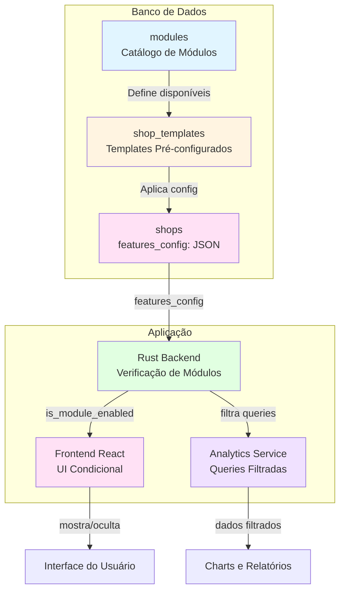
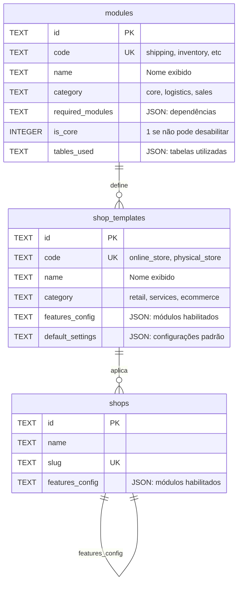
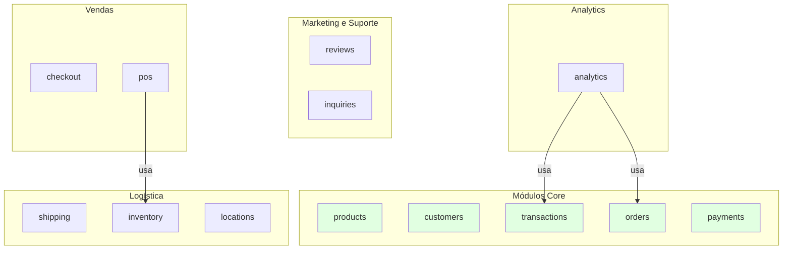
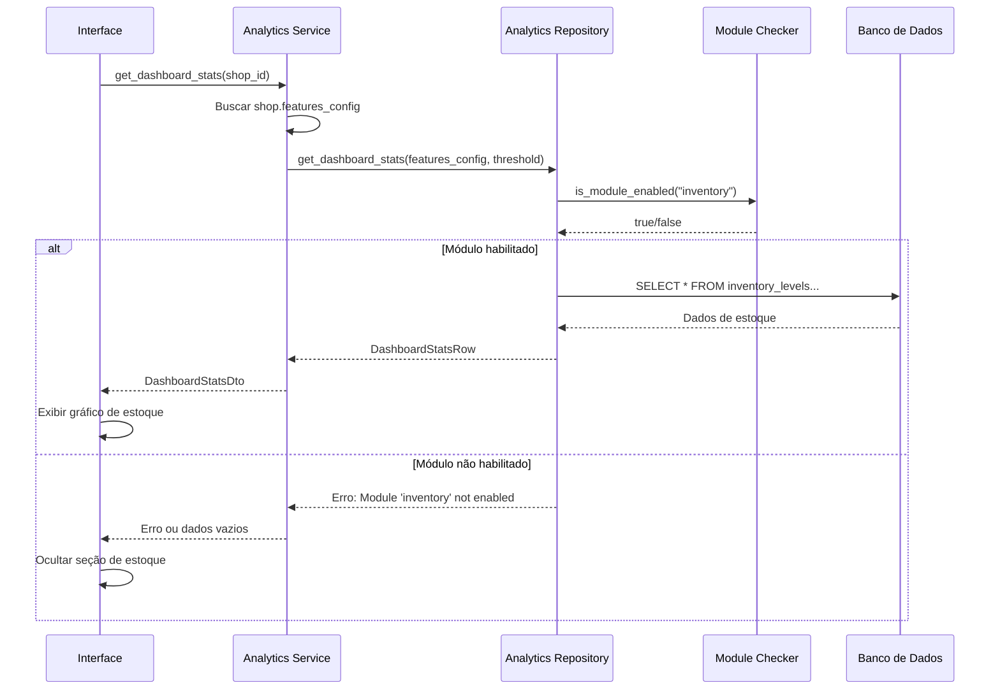

# Plano de Desenvolvimento: Sistema de Módulos e Templates para Shops

Este documento consolida o plano completo de desenvolvimento do sistema modular para shops, incluindo módulos, templates e melhorias na estrutura atual.

---

## 📋 Índice

1. [Visão Geral do Projeto](#visão-geral-do-projeto)
2. [Situação Atual](#situação-atual)
3. [Objetivos e Requisitos](#objetivos-e-requisitos)
4. [Arquitetura da Solução](#arquitetura-da-solução)
5. [Estrutura do Banco de Dados](#estrutura-do-banco-de-dados)
6. [Templates Pré-Configurados](#templates-pré-configurados)
7. [Módulos Disponíveis](#módulos-disponíveis)
8. [Plano de Implementação](#plano-de-implementação)
9. [Implementação Técnica](#implementação-técnica)
10. [Analytics e Filtros por Módulos](#analytics-e-filtros-por-módulos)
11. [Testes e Validação](#testes-e-validação)
12. [Cronograma e Entregas](#cronograma-e-entregas)

---

## Visão Geral do Projeto

### Contexto

O sistema atual usa `shops` como raiz da hierarquia. Cada shop representa uma loja/empresa completa com seus próprios produtos, clientes e pedidos. O sistema precisa ser **generalista ao máximo**, atendendo diferentes tipos de negócio.

### Decisão Arquitetural: Manter Shops

Após análise, decidimos **manter `shops` como está** porque:

✅ **Já atende os requisitos**:
- Múltiplas lojas por instalação (um usuário pode criar N shops)
- Módulos por shop (`features_config` em cada shop)
- Isolamento de dados por `shop_id`
- Multiloja nativo

✅ **Vantagens**:
- Estrutura já existe e funciona
- Menos migrations necessárias
- Templates aplicados diretamente em shops
- Sem necessidade de criar organizations

---

## Situação Atual

### Como Funciona `shops` Atualmente

```
shops (RAIZ - uma loja/empresa)
  ├─ brands (marcas da shop - tem shop_id)
  ├─ categories (categorias da shop - tem shop_id)
  ├─ customer_groups (grupos da shop - tem shop_id)
  ├─ orders (pedidos da shop - tem shop_id)
  │
  ├─ products (produtos - SEM shop_id direto, ligado via brands/categories)
  ├─ customers (clientes - SEM shop_id direto, ligado via orders)
  └─ ... (todas as entidades de negócio)
```

### Estrutura da Tabela `shops`

```sql
CREATE TABLE shops (
    id TEXT PRIMARY KEY,
    name TEXT NOT NULL,
    slug TEXT UNIQUE NOT NULL,
    features_config TEXT,          -- JSON: módulos habilitados (EXISTE)
    mail_config TEXT,              -- JSON: configurações de e-mail
    storage_config TEXT,           -- JSON: configurações de armazenamento
    settings TEXT DEFAULT '{}',    -- JSON: configurações do negócio
    branding TEXT DEFAULT '{}',    -- JSON: identidade visual
    currency TEXT DEFAULT 'BRL',
    timezone TEXT DEFAULT 'America/Sao_Paulo',
    locale TEXT DEFAULT 'pt-BR',
    owner_id TEXT,                 -- ID do usuário dono
    status TEXT DEFAULT 'active',
    _status TEXT DEFAULT 'created',
    created_at DATETIME DEFAULT CURRENT_TIMESTAMP,
    updated_at DATETIME DEFAULT CURRENT_TIMESTAMP
);
```

**Observação**: `features_config` já existe na tabela! ✅

---

## Objetivos e Requisitos

### Objetivo Principal

Criar um sistema modular que permita:
- **Habilitar/desabilitar funcionalidades** por shop sem criar/remover tabelas
- **Templates pré-configurados** para diferentes tipos de negócio
- **Controle granular** via `features_config` (JSON)

### Requisitos

1. **Flexibilidade**: Permitir adicionar/remover módulos conforme necessário
2. **Simplicidade**: Não complicar o uso para o usuário final
3. **Performance**: Não fazer `ALTER TABLE` constantemente (SQLite)
4. **Templates**: Oferecer configurações pré-definidas para tipos comuns de negócio
5. **Analytics**: Sempre disponível, mas filtrar queries baseado em módulos habilitados

### Casos de Uso

- **Loja física somente**: não precisa de `shipping` (entrega)
- **Loja virtual somente**: não precisa de `shops` (lojas físicas - já gerida por shops)
- **Consultoria**: não precisa de `inventory` (estoque) nem `shipping` (entrega)
- **Aula virtual**: não precisa de `inventory` nem `shipping`

---

## Arquitetura da Solução

### Estratégia Escolhida

**Opção**: Todas as Tabelas + Controle via Config ✅

- ✅ Todas as tabelas já criadas no schema inicial (`001_initial_schema.sql`)
- ✅ Controle via JSON (`features_config` em `shops`)
- ✅ Zero impacto de performance (apenas ~30-90 KB de metadados)
- ✅ Flexibilidade máxima sem ALTER TABLE

### Diagrama de Arquitetura



### Componentes

- **`modules`**: Catálogo de todos os módulos disponíveis no sistema
- **`shop_templates`**: Templates pré-configurados para diferentes tipos de negócio
- **`shops.features_config`**: JSON que controla quais módulos estão habilitados por shop
- **Aplicação (Rust/Frontend)**: Verifica módulos habilitados e adapta comportamento

---

## Estrutura do Banco de Dados

### Novas Tabelas Necessárias

#### 1. Tabela `modules`

Define todos os módulos disponíveis no sistema:

```sql
CREATE TABLE modules (
    id TEXT PRIMARY KEY,
    code TEXT UNIQUE NOT NULL,              -- 'shipping', 'inventory', etc.
    name TEXT NOT NULL,                     -- Nome exibido ao usuário
    description TEXT,                       -- Descrição do módulo
    category TEXT,                          -- 'core', 'logistics', 'sales', etc.
    icon TEXT,                              -- Ícone/nome do ícone
    version TEXT DEFAULT '1.0.0',
    required_modules TEXT DEFAULT '[]',     -- JSON array: dependências
    conflicts_with TEXT DEFAULT '[]',       -- JSON array: conflitos
    tables_used TEXT DEFAULT '[]',          -- JSON array: tabelas utilizadas
    is_core INTEGER DEFAULT 0,              -- 1 se não pode ser desabilitado
    metadata TEXT DEFAULT '{}',             -- JSONB: configurações adicionais
    _status TEXT DEFAULT 'created',
    created_at DATETIME DEFAULT CURRENT_TIMESTAMP,
    updated_at DATETIME DEFAULT CURRENT_TIMESTAMP
);

CREATE INDEX idx_modules_code ON modules(code) WHERE _status != 'deleted';
CREATE INDEX idx_modules_category ON modules(category) WHERE _status != 'deleted';
```

#### 2. Tabela `shop_templates`

Templates pré-configurados para diferentes tipos de negócio:

```sql
CREATE TABLE shop_templates (
    id TEXT PRIMARY KEY,
    code TEXT UNIQUE NOT NULL,              -- 'online_store', 'physical_store', etc.
    name TEXT NOT NULL,                     -- Nome exibido
    description TEXT,                       -- Descrição do tipo de negócio
    category TEXT,                          -- 'retail', 'services', 'ecommerce', etc.
    icon TEXT,                              -- Ícone/nome do ícone
    features_config TEXT NOT NULL,          -- JSONB: configuração a ser aplicada
    default_settings TEXT DEFAULT '{}',     -- JSONB: configurações padrão
    recommended_modules TEXT DEFAULT '[]',  -- JSON array: módulos recomendados
    metadata TEXT DEFAULT '{}',             -- JSONB: informações adicionais
    _status TEXT DEFAULT 'created',
    created_at DATETIME DEFAULT CURRENT_TIMESTAMP,
    updated_at DATETIME DEFAULT CURRENT_TIMESTAMP
);

CREATE INDEX idx_shop_templates_code ON shop_templates(code) WHERE _status != 'deleted';
CREATE INDEX idx_shop_templates_category ON shop_templates(category) WHERE _status != 'deleted';
```

### Diagrama ER



### Formato do `features_config`

O campo `features_config` (TEXT/JSONB) em `shops` controla quais módulos estão habilitados:

```json
{
  "products": true,      // Core - sempre true
  "customers": true,     // Core - sempre true
  "transactions": true,  // Core - sempre true
  "orders": true,        // Core - sempre true
  "payments": true,      // Core - sempre true
  "shipping": true,      // Opcional
  "inventory": false,    // Opcional
  "pos": false,          // Opcional
  "checkout": true,      // Opcional
  "reviews": true,       // Opcional
  "inquiries": true,     // Opcional
  "analytics": true      // Sempre true (disponível para todos)
}
```

---

## Templates Pré-Configurados

### Templates Disponíveis

#### 1. `online_store` - Loja Virtual

**Módulos habilitados**:
- ✅ Core: products, customers, transactions, orders, payments
- ✅ shipping, checkout, inventory, inquiries, reviews, analytics
- ❌ pos, locations

**Configurações padrão**:
```json
{"allow_guest_checkout": true, "require_shipping": true}
```

#### 2. `physical_store` - Loja Física

**Módulos habilitados**:
- ✅ Core: products, customers, transactions, orders, payments
- ✅ pos, inventory, locations, inquiries, analytics
- ❌ shipping, checkout, reviews

**Configurações padrão**:
```json
{"require_shipping": false, "allow_offline_sales": true}
```

#### 3. `marketplace` - Marketplace

**Módulos habilitados**:
- ✅ Core: products, customers, transactions, orders, payments
- ✅ shipping, checkout, inventory, locations, inquiries, reviews, analytics
- ❌ pos

**Configurações padrão**:
```json
{"multi_vendor": true, "allow_guest_checkout": true, "require_shipping": true}
```

#### 4. `hybrid_store` - Loja Física e Virtual

**Módulos habilitados**:
- ✅ **Todos os módulos habilitados**

**Configurações padrão**:
```json
{"allow_guest_checkout": true, "require_shipping": true, "allow_offline_sales": true}
```

#### 5. `consulting` - Consultoria/Serviços

**Módulos habilitados**:
- ✅ Core: products (services), customers, transactions, orders, payments
- ✅ inquiries, analytics
- ❌ shipping, inventory, checkout, pos, reviews, locations

**Configurações padrão**:
```json
{"product_type_default": "service", "require_shipping": false}
```

#### 6. `online_education` - Aula Virtual/Educação

**Módulos habilitados**:
- ✅ Core: products (digital), customers, transactions, orders, payments
- ✅ checkout, inquiries, reviews, analytics
- ❌ shipping, inventory, pos, locations

**Configurações padrão**:
```json
{"product_type_default": "digital", "require_shipping": false, "allow_guest_checkout": false}
```

### Diagrama: Templates e Módulos

```mermaid
graph TB
    subgraph "Templates"
        OS[online_store<br/>Loja Virtual]
        PS[physical_store<br/>Loja Física]
        MP[marketplace<br/>Marketplace]
        HS[hybrid_store<br/>Física + Virtual]
        CN[consulting<br/>Consultoria]
        ED[online_education<br/>Aula Virtual]
    end

    subgraph "Módulos Core - Sempre Habilitados"
        PR[products]
        CU[customers]
        TR[transactions]
        OR[orders]
        PA[payments]
    end

    subgraph "Módulos Opcionais"
        SH[shipping]
        IV[inventory]
        CK[checkout]
        PO[pos]
        LO[locations]
        RE[reviews]
        IN[inquiries]
        AN[analytics]
    end

    OS --> PR & CU & TR & OR & PA & SH & IV & CK & RE & IN & AN
    PS --> PR & CU & TR & OR & PA & PO & IV & LO & IN & AN
    MP --> PR & CU & TR & OR & PA & SH & IV & CK & LO & RE & IN & AN
    HS --> PR & CU & TR & OR & PA & SH & IV & CK & PO & LO & RE & IN & AN
    CN --> PR & CU & TR & OR & PA & IN & AN
    ED --> PR & CU & TR & OR & PA & CK & RE & IN & AN

    style OS fill:#e1f5ff
    style PS fill:#fff4e1
    style MP fill:#e1ffe1
    style HS fill:#ffe1f5
    style CN fill:#f0e1ff
    style ED fill:#ffe1e1
```



---

## Módulos Disponíveis

### Módulos Core (Sempre Habilitados)

1. **`products`** - Catálogo de Produtos
   - Tabelas: `products`, `brands`, `categories`, `product_categories`

2. **`customers`** - Gerenciamento de Clientes
   - Tabelas: `customers`, `customer_addresses`, `customer_groups`, `customer_group_memberships`

3. **`transactions`** - Registro de Transações
   - Tabelas: `transactions`, `transaction_items`

4. **`orders`** - Gerenciamento de Pedidos
   - Tabelas: `orders`

5. **`payments`** - Processamento de Pagamentos
   - Tabelas: `payments`, `refunds`

### Módulos Opcionais

#### Logística
- **`shipping`** - Entrega/Shipping
  - Tabelas: `shipments`, `shipment_items`, `shipment_events`
- **`inventory`** - Estoque
  - Tabelas: `inventory_levels`, `inventory_movements`
- **`locations`** - Locais/Depósitos
  - Tabelas: `locations`

#### Vendas
- **`checkout`** - Checkout/Carrinho
  - Tabelas: `checkouts`
- **`pos`** - Ponto de Venda
  - Tabelas: (utiliza tabelas de outros módulos - não possui tabelas próprias)

#### Marketing e Suporte
- **`reviews`** - Avaliações
  - Tabelas: `reviews`, `product_metrics`
- **`inquiries`** - Atendimento/SAC
  - Tabelas: `inquiries`, `inquiry_messages`

#### Analytics
- **`analytics`** - Analytics/Relatórios (sempre disponível, filtra por módulos)
  - Tabelas: (utiliza tabelas de outros módulos - não possui tabelas próprias)

### Mapeamento Completo de Tabelas por Módulo

| Módulo | Tabelas | Total |
|-------|---------|-------|
| **products** (core) | `products`, `brands`, `categories`, `product_categories` | 4 |
| **customers** (core) | `customers`, `customer_addresses`, `customer_groups`, `customer_group_memberships` | 4 |
| **transactions** (core) | `transactions`, `transaction_items` | 2 |
| **orders** (core) | `orders` | 1 |
| **payments** (core) | `payments`, `refunds` | 2 |
| **shipping** (opcional) | `shipments`, `shipment_items`, `shipment_events` | 3 |
| **inventory** (opcional) | `inventory_levels`, `inventory_movements` | 2 |
| **locations** (opcional) | `locations` | 1 |
| **checkout** (opcional) | `checkouts` | 1 |
| **pos** (opcional) | - | 0 |
| **reviews** (opcional) | `reviews`, `product_metrics` | 2 |
| **inquiries** (opcional) | `inquiries`, `inquiry_messages` | 2 |
| **analytics** (opcional) | - | 0 |
| **TOTAL** | **24 tabelas operacionais** | **24** |

**Nota**: Todas as tabelas operacionais estão cobertas e não há repetição entre módulos.

### Diagrama de Categorias



---

## Plano de Implementação

### Fase 1: Banco de Dados ✅

**Migration**: `002_modules_system.sql`

**Tarefas**:
1. Criar tabela `modules`
2. Criar tabela `shop_templates`
3. Popular `modules` com módulos disponíveis
4. Popular `shop_templates` com templates pré-configurados

**Entregável**: Migration completa com todas as tabelas e dados iniciais

### Fase 2: Backend (Rust) ⏳

**Tarefas**:
1. Criar `module_checker.rs` (helper para verificar módulos)
2. Atualizar `AnalyticsRepository` para aceitar `features_config`
3. Atualizar `AnalyticsService` para buscar `features_config` da shop
4. Criar repositories/services para `modules` e `shop_templates`
5. Atualizar `ShopService` para usar templates ao criar shop

**Entregáveis**:
- `src-tauri/src/features/analytics/utils/module_checker.rs`
- Atualizações em `analytics_repository.rs` e `analytics_service.rs`
- Novos arquivos para `modules` e `shop_templates`

### Fase 3: Frontend (React/TypeScript) ⏳

**Tarefas**:
1. Criar hook `useModuleEnabled` para verificar módulos
2. Atualizar componentes para ocultar/mostrar baseado em módulos
3. Criar UI para seleção de template ao criar shop
4. Criar UI para gerenciar módulos habilitados por shop

**Entregáveis**:
- `hooks/useModuleEnabled.ts`
- Componentes atualizados com verificação de módulos
- Página de criação de shop com templates

### Fase 4: Analytics com Filtros ⏳

**Tarefas**:
1. Atualizar todas as queries de analytics para verificar módulos
2. Retornar erro ou dados vazios quando módulo não habilitado
3. Atualizar frontend para ocultar gráficos/relatórios baseado em módulos

**Entregáveis**:
- `AnalyticsRepository` atualizado com verificações
- Frontend que adapta exibição baseado em módulos habilitados

### Fase 5: Documentação e Testes ⏳

**Tarefas**:
1. Atualizar documentação do sistema
2. Criar testes para verificação de módulos
3. Testar todos os templates pré-configurados
4. Validar filtros de analytics

**Entregáveis**:
- Documentação atualizada
- Testes automatizados
- Validação completa do sistema

---

## Implementação Técnica

### Backend: Helper para Verificar Módulos

```rust
// src-tauri/src/features/analytics/utils/module_checker.rs

use serde_json::Value;

/// Verifica se um módulo está habilitado baseado no features_config
pub fn is_module_enabled(features_config: Option<&str>, module_code: &str) -> bool {
    let config_str = match features_config {
        Some(s) => s,
        None => return true, // Sem configuração = todos habilitados (compatibilidade)
    };

    let config: Value = match serde_json::from_str(config_str) {
        Ok(c) => c,
        Err(_) => return true, // JSON inválido = todos habilitados (safe default)
    };

    let config_obj = match config.as_object() {
        Some(obj) => obj,
        None => return true,
    };

    match config_obj.get(module_code) {
        Some(val) => val.as_bool().unwrap_or(true),
        None => true, // Módulo não definido = habilitado (compatibilidade retroativa)
    }
}

/// Módulos core sempre habilitados
pub const CORE_MODULES: &[&str] = &["products", "customers", "transactions", "orders", "payments"];

/// Verifica se um módulo é core (sempre habilitado)
pub fn is_core_module(module_code: &str) -> bool {
    CORE_MODULES.contains(&module_code)
}

/// Verifica módulo com fallback para core
pub fn is_module_enabled_or_core(features_config: Option<&str>, module_code: &str) -> bool {
    if is_core_module(module_code) {
        return true;
    }
    is_module_enabled(features_config, module_code)
}
```

### Backend: Uso no Repository

```rust
// analytics_repository.rs

use crate::features::analytics::utils::module_checker;

impl AnalyticsRepository {
    fn check_module_required(&self, features_config: Option<&str>, module_code: &str) -> sqlx::Result<()> {
        if !module_checker::is_module_enabled_or_core(features_config, module_code) {
            return Err(sqlx::Error::Configuration(
                format!("Module '{}' is not enabled", module_code).into()
            ));
        }
        Ok(())
    }

    pub async fn get_dashboard_stats(
        &self, 
        features_config: Option<&str>,  // Novo parâmetro
        low_stock_threshold: f64
    ) -> sqlx::Result<DashboardStatsRow> {
        self.check_module_required(features_config, "inventory")?;
        // ... query existente ...
    }
}
```

### Frontend: Hook para Verificar Módulos

```typescript
// hooks/useModuleEnabled.ts

import { useShop } from '@/hooks/useShop';

export function useModuleEnabled(moduleCode: string): boolean {
  const { shop } = useShop();
  
  if (!shop?.features_config) {
    return true; // Sem configuração = todos habilitados (compatibilidade)
  }

  const coreModules = ['products', 'customers', 'transactions', 'orders', 'payments'];
  if (coreModules.includes(moduleCode)) {
    return true; // Módulos core sempre habilitados
  }

  try {
    const config = JSON.parse(shop.features_config);
    return config[moduleCode] === true;
  } catch {
    return true; // JSON inválido = todos habilitados (safe default)
  }
}
```

### Frontend: Uso em Componentes

```typescript
// components/ShippingSection.tsx

import { useModuleEnabled } from '@/hooks/useModuleEnabled';

export function ShippingSection() {
  const isShippingEnabled = useModuleEnabled('shipping');

  if (!isShippingEnabled) {
    return null; // Não renderiza se módulo não habilitado
  }

  return <div>{/* Componente de shipping */}</div>;
}
```

---

## Analytics e Filtros por Módulos

### Princípio

**Analytics está sempre disponível**, mas filtra queries baseado nos módulos habilitados na shop.

### Mapeamento de Queries para Módulos

| Query Analytics | Módulo Necessário | Comportamento se Desabilitado |
|----------------|-------------------|------------------------------|
| `get_dashboard_stats` | `inventory` | ❌ Retorna erro |
| `get_stock_movements` | `inventory` | ❌ Retorna erro |
| `get_stock_status` | `inventory` | ❌ Retorna erro |
| `get_conversion_rate` | `checkout` | ❌ Retorna erro |
| `get_cumulative_revenue` | `orders` (core) | ✅ Sempre disponível |
| `get_monthly_sales` | `orders` (core) | ✅ Sempre disponível |
| `get_top_products` | `products` (core) | ✅ Sempre disponível |

### Fluxo: Query Analytics com Verificação



---

## Testes e Validação

### Testes de Módulos

1. **Verificação de módulos core**:
   - ✅ Sempre retornam `true`
   - ✅ Não dependem de `features_config`

2. **Verificação de módulos opcionais**:
   - ✅ Retornam `true` quando habilitados em `features_config`
   - ✅ Retornam `false` quando desabilitados
   - ✅ Retornam `true` quando `features_config` é `null` (compatibilidade)

3. **Templates**:
   - ✅ Criar shop com template aplica `features_config` correto
   - ✅ Todos os templates pré-configurados funcionam

### Testes de Analytics

1. **Queries que requerem módulo**:
   - ✅ Retornam erro quando módulo não habilitado
   - ✅ Retornam dados quando módulo habilitado

2. **Queries que usam módulo opcional**:
   - ✅ Funcionam com módulo desabilitado (valores zerados)
   - ✅ Funcionam normalmente com módulo habilitado

---

## Cronograma e Entregas

### Sprint 1: Banco de Dados (1-2 dias)

- [ ] Criar migration `002_modules_system.sql`
- [ ] Popular módulos iniciais
- [ ] Popular templates pré-configurados
- [ ] Testar migrations

**Entregável**: Migration funcional

### Sprint 2: Backend - Helpers e Utilities (2-3 dias)

- [ ] Criar `module_checker.rs`
- [ ] Criar repositories para `modules` e `shop_templates`
- [ ] Atualizar `ShopService` para usar templates
- [ ] Testes unitários

**Entregável**: Backend com verificação de módulos funcionando

### Sprint 3: Backend - Analytics (2-3 dias)

- [ ] Atualizar `AnalyticsRepository` com verificação de módulos
- [ ] Atualizar `AnalyticsService` para passar `features_config`
- [ ] Testar todas as queries de analytics
- [ ] Validar filtros

**Entregável**: Analytics filtrando por módulos

### Sprint 4: Frontend - Hooks e Componentes (2-3 dias)

- [ ] Criar hook `useModuleEnabled`
- [ ] Atualizar componentes para verificar módulos
- [ ] Atualizar rotas para ocultar baseado em módulos
- [ ] Testes de integração

**Entregável**: Frontend adaptando UI baseado em módulos

### Sprint 5: Frontend - Templates UI (2-3 dias)

- [ ] Página de criação de shop com seleção de template
- [ ] UI para gerenciar módulos habilitados
- [ ] Validação e feedback visual
- [ ] Testes E2E

**Entregável**: UI completa de templates e módulos

### Sprint 6: Testes e Documentação (1-2 dias)

- [ ] Testes completos do sistema
- [ ] Documentação atualizada
- [ ] Validação final
- [ ] Code review

**Entregável**: Sistema completo testado e documentado

**Total Estimado**: 10-16 dias de desenvolvimento

---

## Considerações de Performance

### Impacto de Storage

- **Tabelas vazias**: ~1-3 KB cada (apenas metadados)
- **30 tabelas vazias**: ~30-90 KB total
- **Conclusão**: Impacto mínimo e negligenciável

### Verificação de Módulos

- **Performance**: Parse de JSON em memória (rápido)
- **Cache**: Considerar cachear `features_config` parseado (opcional)
- **Overhead**: Desprezível comparado ao benefício de flexibilidade

### Queries Condicionais

- **Complexidade**: Queries não mudam, apenas verificamos antes de executar
- **Performance**: Zero impacto na query em si

---

## Melhorias Futuras (Opcional)

### 1. Múltiplos Usuários por Shop

Se necessário no futuro, adicionar tabela `shop_members`:

```sql
CREATE TABLE shop_members (
    shop_id TEXT REFERENCES shops(id) ON DELETE CASCADE,
    user_id TEXT REFERENCES users(id) ON DELETE CASCADE,
    role TEXT DEFAULT 'member', -- 'owner', 'admin', 'member'
    _status TEXT DEFAULT 'created',
    created_at DATETIME DEFAULT CURRENT_TIMESTAMP,
    updated_at DATETIME DEFAULT CURRENT_TIMESTAMP,
    PRIMARY KEY (shop_id, user_id)
);
```

### 2. Cache de `features_config`

Para melhor performance, cachear `features_config` parseado em memória:
- Invalidar cache quando shop é atualizado
- Considerar usar Redis ou cache em memória (se escalar)

### 3. Validação de Dependências (Opcional)

Caso necessário no futuro, implementar validação de dependências entre módulos opcionais:
- `pos` poderia requerer `inventory` (se ambos forem opcionais)
- Outras dependências podem ser adicionadas conforme necessário

**Nota**: Dependências de módulos core não precisam ser validadas, pois sempre estão habilitados.

---

## Referências

- [MODULES.md](./DATABASE/MODULES.md) - Documentação detalhada do sistema de módulos
- [SHOPS.md](./DATABASE/SHOPS.md) - Documentação da tabela shops
- [SCHEMA.md](./DATABASE/SCHEMA.md) - Schema completo do banco de dados
- [ANALYTICS_QUERIES.md](./ANALYTICS_QUERIES.md) - Queries de analytics

---

## Conclusão

Este plano de desenvolvimento estabelece a arquitetura completa para implementar o sistema de módulos e templates para shops. A solução mantém a estrutura atual de `shops`, adicionando flexibilidade através de módulos e templates pré-configurados.

**Principais benefícios**:
- ✅ Flexibilidade máxima sem ALTER TABLE
- ✅ Templates para setup rápido
- ✅ Analytics adaptativo
- ✅ Performance zero impacto
- ✅ Escalável para novos módulos

**Próximo passo**: Iniciar Fase 1 - Criação da migration `002_modules_system.sql`
