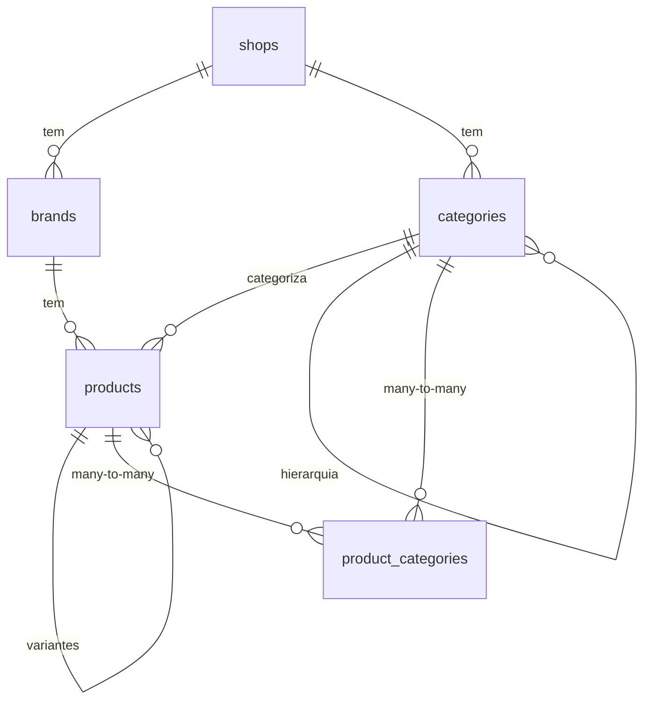
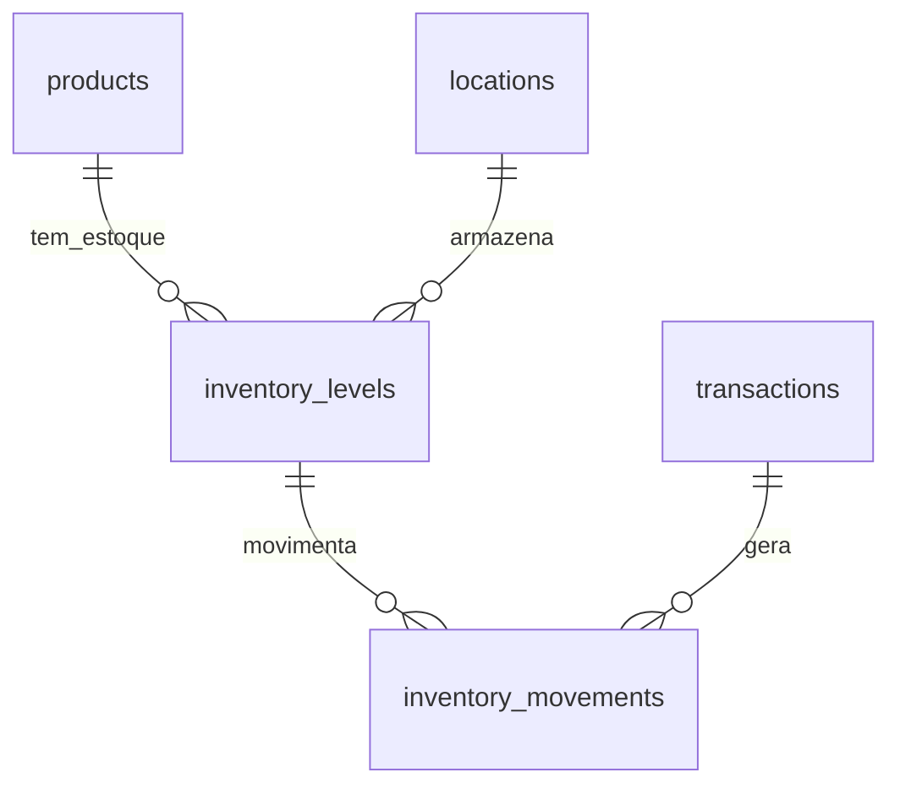
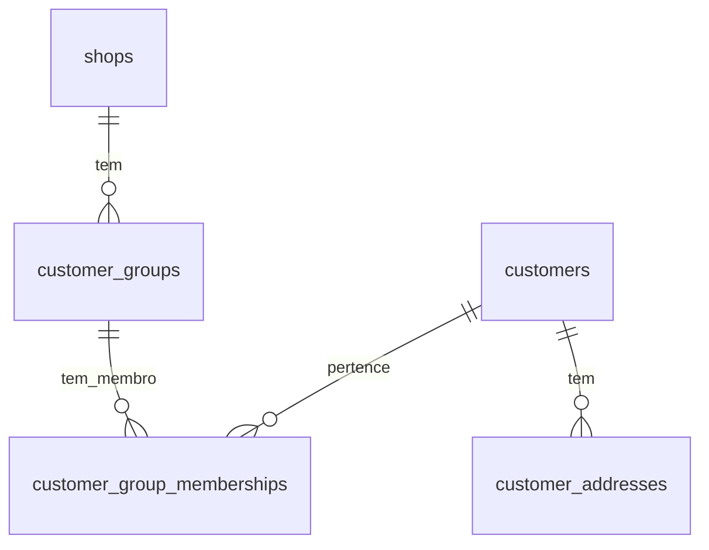
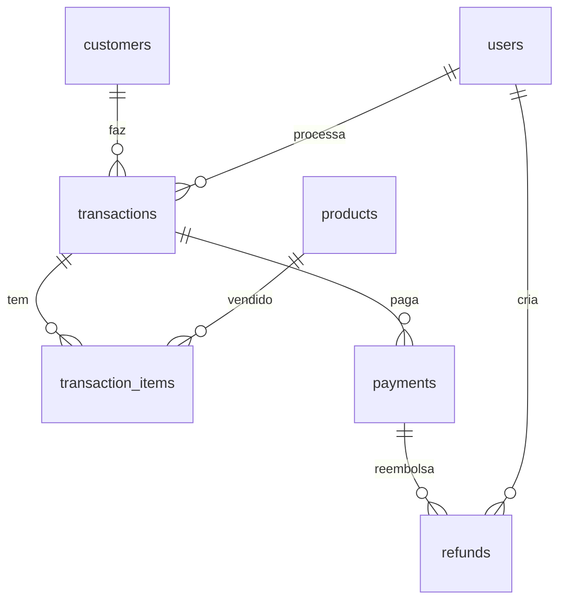
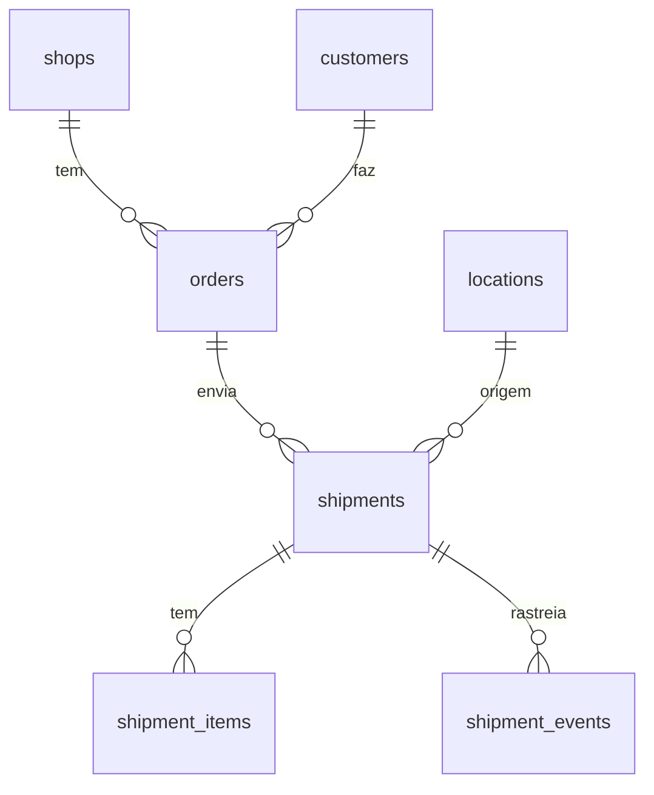
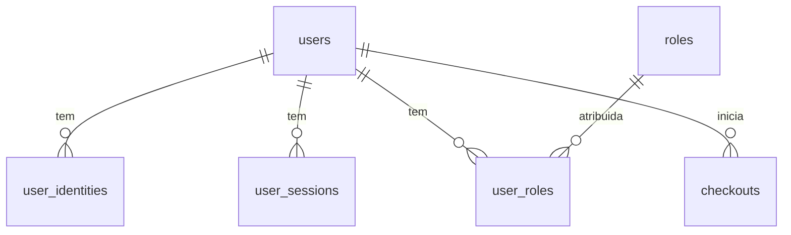
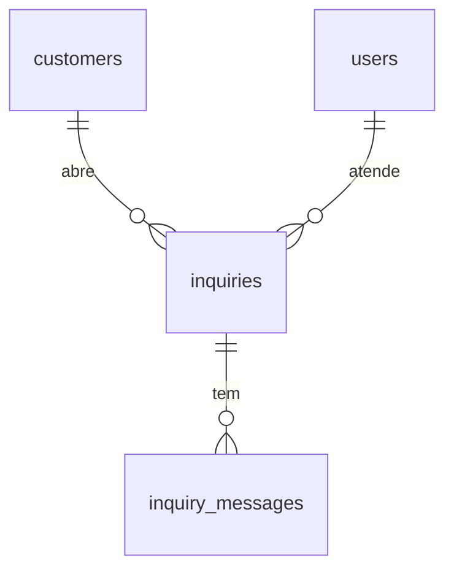
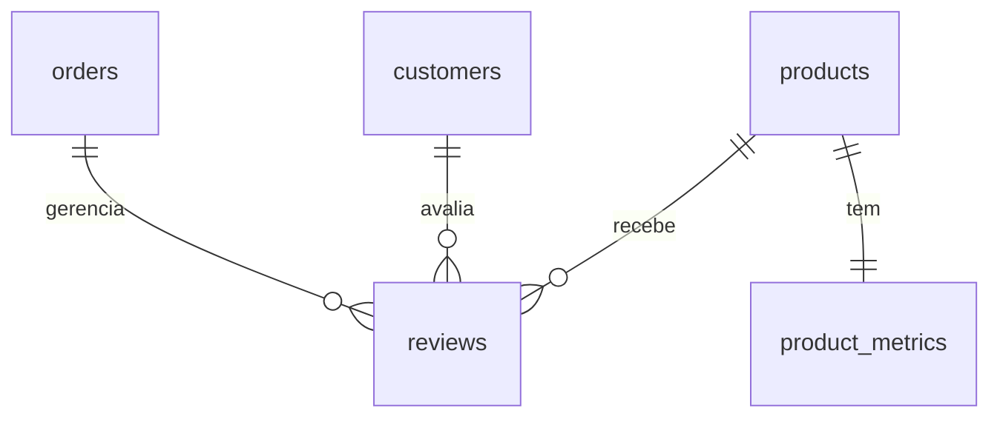

# Modelagem do Banco de Dados

Este documento apresenta a modelagem completa do banco de dados baseada no schema inicial (`001_initial_schema.sql`).

## Diagrama ER Completo

```mermaid
erDiagram
    %% Entidades Base
    shops ||--o{ brands : "tem"
    shops ||--o{ categories : "tem"
    shops ||--o{ customer_groups : "tem"
    shops ||--o{ orders : "tem"
    
    %% Hierarquia de Categorias
    categories ||--o{ categories : "parent_id"
    categories ||--o{ products : "categoria"
    categories ||--o{ product_categories : "em"
    
    %% Marcas e Produtos
    brands ||--o{ products : "tem"
    products ||--o{ products : "variante"
    products ||--o{ product_categories : "pertence"
    products ||--o{ inventory_levels : "tem_estoque"
    products ||--o{ transaction_items : "vendido"
    products ||--o{ reviews : "avaliado"
    products ||--|| product_metrics : "tem_metricas"
    
    %% Estoque
    locations ||--o{ inventory_levels : "armazena"
    inventory_levels ||--o{ inventory_movements : "movimenta"
    
    %% Clientes
    customers ||--o{ customer_group_memberships : "pertence"
    customers ||--o{ customer_addresses : "tem_endereco"
    customers ||--o{ transactions : "faz_compra"
    customers ||--o{ orders : "faz_pedido"
    customers ||--o{ inquiries : "abre"
    customers ||--o{ reviews : "avalia"
    
    customer_groups ||--o{ customer_group_memberships : "tem_membro"
    
    %% Transações
    transactions ||--o{ transaction_items : "tem_item"
    transactions ||--o{ inventory_movements : "gera"
    transactions ||--o{ payments : "paga_com"
    
    users ||--o{ transactions : "processa"
    users ||--o{ refunds : "cria"
    users ||--o{ checkouts : "inicia"
    users ||--o{ user_identities : "tem_identidade"
    users ||--o{ user_sessions : "tem_sessao"
    users ||--o{ user_roles : "tem_role"
    users ||--o{ inquiries : "atende"
    
    %% Pagamentos
    payments ||--o{ refunds : "reembolsa"
    
    %% Pedidos e Envios
    orders ||--o{ shipments : "envia"
    orders ||--o{ reviews : "gerencia"
    
    shipments ||--o{ shipment_items : "tem_item"
    shipments ||--o{ shipment_events : "tem_evento"
    
    locations ||--o{ shipments : "origem"
    
    %% Inquéritos
    inquiries ||--o{ inquiry_messages : "tem_mensagem"
    
    %% Autenticação e Autorização
    roles ||--o{ user_roles : "atribuida"
    
    %% Atributos das Entidades
    shops {
        TEXT id PK
        TEXT name
        TEXT slug UK
        TEXT status
        TEXT owner_id
    }
    
    brands {
        TEXT id PK
        TEXT shop_id FK
        TEXT name
        TEXT slug
        TEXT status
    }
    
    categories {
        TEXT id PK
        TEXT shop_id FK
        TEXT parent_id FK
        TEXT name
        TEXT slug
        TEXT type
    }
    
    products {
        TEXT id PK
        TEXT sku UK
        TEXT type
        TEXT status
        TEXT name
        TEXT slug UK
        REAL price
        TEXT category_id FK
        TEXT brand_id FK
        TEXT parent_id FK
    }
    
    product_categories {
        TEXT product_id FK
        TEXT category_id FK
        INTEGER position
    }
    
    locations {
        TEXT id PK
        TEXT name
        TEXT type
        INTEGER is_sellable
    }
    
    inventory_levels {
        TEXT id PK
        TEXT product_id FK
        TEXT location_id FK
        TEXT batch_number
        TEXT serial_number
        REAL quantity_on_hand
        REAL quantity_reserved
        TEXT stock_status
    }
    
    inventory_movements {
        TEXT id PK
        TEXT transaction_id FK
        TEXT inventory_level_id FK
        TEXT type
        REAL quantity
        REAL previous_balance
        REAL new_balance
    }
    
    customers {
        TEXT id PK
        TEXT type
        TEXT email UK
        TEXT phone
        TEXT first_name
        TEXT last_name
        TEXT status
        TEXT customer_group_id FK
    }
    
    customer_groups {
        TEXT id PK
        TEXT shop_id FK
        TEXT name
        TEXT code
        TEXT type
    }
    
    customer_group_memberships {
        TEXT customer_id FK
        TEXT customer_group_id FK
    }
    
    customer_addresses {
        TEXT id PK
        TEXT customer_id FK
        TEXT type
        INTEGER is_default
        TEXT address1
        TEXT city
        TEXT country_code
    }
    
    users {
        TEXT id PK
        TEXT email UK
        TEXT phone UK
        TEXT password_hash
        TEXT status
    }
    
    transactions {
        TEXT id PK
        TEXT type
        TEXT status
        TEXT customer_id FK
        TEXT staff_id FK
        TEXT currency
        REAL total_net
    }
    
    transaction_items {
        TEXT id PK
        TEXT transaction_id FK
        TEXT product_id FK
        TEXT sku_snapshot
        REAL quantity
        REAL unit_price
    }
    
    payments {
        TEXT id PK
        TEXT transaction_id FK
        REAL amount
        TEXT currency
        TEXT provider
        TEXT method
        TEXT status
    }
    
    refunds {
        TEXT id PK
        TEXT payment_id FK
        REAL amount
        TEXT status
        TEXT created_by FK
    }
    
    checkouts {
        TEXT id PK
        TEXT token UK
        TEXT user_id FK
        TEXT email
        TEXT status
        REAL total_price
    }
    
    orders {
        TEXT id PK
        INTEGER order_number
        TEXT shop_id FK
        TEXT customer_id FK
        TEXT status
        TEXT payment_status
        TEXT fulfillment_status
        REAL total_price
    }
    
    shipments {
        TEXT id PK
        TEXT order_id FK
        TEXT location_id FK
        TEXT status
        TEXT tracking_number
    }
    
    shipment_items {
        TEXT id PK
        TEXT shipment_id FK
        TEXT order_item_id
        INTEGER quantity
    }
    
    shipment_events {
        TEXT id PK
        TEXT shipment_id FK
        TEXT status
        TEXT description
        DATETIME happened_at
    }
    
    user_identities {
        TEXT id PK
        TEXT user_id FK
        TEXT provider
        TEXT provider_user_id
    }
    
    user_sessions {
        TEXT id PK
        TEXT user_id FK
        TEXT token_hash
        DATETIME expires_at
    }
    
    roles {
        TEXT id PK
        TEXT name UK
        TEXT permissions
    }
    
    user_roles {
        TEXT user_id FK
        TEXT role_id FK
    }
    
    inquiries {
        TEXT id PK
        TEXT protocol_number UK
        TEXT type
        TEXT status
        TEXT customer_id FK
        TEXT assigned_staff_id FK
    }
    
    inquiry_messages {
        TEXT id PK
        TEXT inquiry_id FK
        TEXT sender_type
        TEXT sender_id
        TEXT body
    }
    
    reviews {
        TEXT id PK
        TEXT order_id FK
        TEXT customer_id FK
        TEXT product_id FK
        INTEGER rating
        TEXT title
        TEXT body
    }
    
    product_metrics {
        TEXT product_id PK
        REAL average_rating
        INTEGER review_count
    }
    
    audit_logs {
        TEXT id PK
        TEXT table_name
        TEXT record_id
        TEXT action
        TEXT old_data
        TEXT new_data
        TEXT changed_by
    }
    
    settings {
        TEXT id PK
        TEXT key UK
        TEXT value
    }
```

## Relações por Domínio

### 1. Shops (Lojas) - Núcleo do Sistema

As lojas são a base da hierarquia do sistema:

- **shops** → **brands** (1:N)
- **shops** → **categories** (1:N)
- **shops** → **customer_groups** (1:N)
- **shops** → **orders** (1:N)

### 2. Catálogo de Produtos

**Relacionamentos:**
- **categories** → **categories** (self-reference via `parent_id` para hierarquia)
- **products** → **products** (self-reference via `parent_id` para variantes)
- **products** ↔ **categories** (many-to-many via `product_categories`)

### 3. Gestão de Estoque

**Relacionamentos:**
- **inventory_levels** representa o estoque de um produto em um local específico
- **inventory_movements** registra todas as movimentações (entrada/saída)
- **transactions** podem gerar movimentações de estoque

### 4. Clientes e Grupos

**Relacionamentos:**
- **customers** ↔ **customer_groups** (many-to-many via `customer_group_memberships`)
- **customer_groups** pertencem a uma **shop**
- **customer_addresses** são exclusivos de um **customer**

### 5. Transações e Vendas

**Relacionamentos:**
- **transactions** são o registro principal de vendas/compras
- **transaction_items** armazena os produtos vendidos (com snapshot)
- **payments** são vinculados a uma **transaction**
- **refunds** são vinculados a um **payment**

### 6. Pedidos e Envios

**Relacionamentos:**
- **orders** são pedidos de clientes vinculados a uma **shop**
- **shipments** são envios de um **order**
- **shipment_events** rastreiam o histórico do envio

### 7. Autenticação e Autorização

**Relacionamentos:**
- **user_identities** permite login via OAuth/externos
- **user_sessions** gerencia sessões ativas
- **users** ↔ **roles** (many-to-many via `user_roles`)

### 8. Suporte e Inquéritos

**Relacionamentos:**
- **inquiries** são tickets de suporte
- **inquiry_messages** são as mensagens do atendimento

### 9. Avaliações e Métricas

**Relacionamentos:**
- **reviews** avaliam **products** de **orders** feitos por **customers**
- **product_metrics** armazena métricas agregadas (calculadas via triggers)

## Convenções de Foreign Keys

### ON DELETE CASCADE
Usado em tabelas dependentes sem valor próprio ou join tables:
- `customer_addresses` → `customers`
- `user_identities` → `users`
- `user_sessions` → `users`
- `transaction_items` → `transactions`
- `shipment_items` → `shipments`
- `shipment_events` → `shipments`
- `inquiry_messages` → `inquiries`
- `product_categories` → `products` e `categories`
- `customer_group_memberships` → `customers` e `customer_groups`
- `user_roles` → `users` e `roles`
- `product_metrics` → `products`

### ON DELETE SET NULL
Usado para FKs opcionais onde o registro pai pode ser removido:
- `categories.parent_id` → `categories`
- `products.category_id` → `categories`
- `products.brand_id` → `brands`
- `products.parent_id` → `products`
- `transactions.customer_id` → `customers`
- `transactions.staff_id` → `users`
- `inventory_movements.transaction_id` → `transactions`
- `shipments.location_id` → `locations`

### ON DELETE RESTRICT
Usado para FKs críticas onde a deleção deve ser bloqueada:
- `brands.shop_id` → `shops`
- `categories.shop_id` → `shops`
- `customer_groups.shop_id` → `shops`
- `orders.shop_id` → `shops`
- `inventory_levels.product_id` → `products`
- `inventory_levels.location_id` → `locations`
- `transactions` → `payments`
- `payments` → `refunds`

## Tabelas Independentes

Algumas tabelas não possuem foreign keys:
- **locations**: Locais de armazenamento independentes
- **settings**: Configurações globais do sistema
- **audit_logs**: Logs de auditoria
- **roles**: Definições de papéis/permissões

## Soft Delete

Todas as tabelas de negócio utilizam soft delete através do campo `_status` com valor `'deleted'` em vez de remoção física dos registros.
