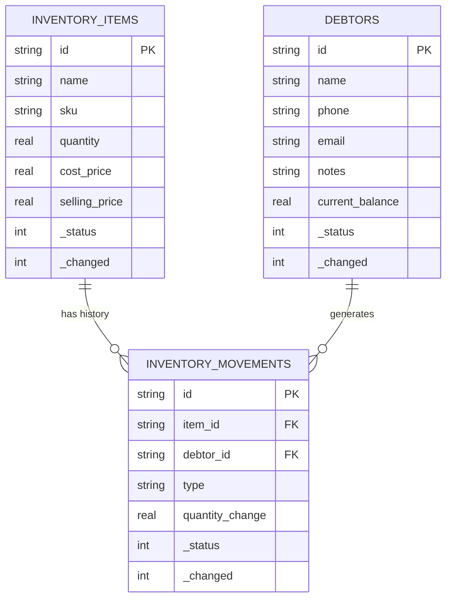

# Documentação do Banco de Dados: Inventy

Esta documentação detalha a estrutura do banco de dados SQLite utilizado tanto no **Mother Node (Desktop)** quanto nos **Satellite Nodes (Mobile)**. O schema é desenhado para suportar o protocolo de sincronização do WatermelonDB.

## 1. Princípios Fundamentais

### Identificadores Únicos (UUIDs)

Para evitar colisões de ID entre dispositivos offline, **todos** os registros utilizam UUID v4 como Chave Primária (`id`). IDs auto-incrementais (`1, 2, 3`) são proibidos.

### Imutabilidade de Log

Movimentações de estoque não alteram apenas um contador. Elas geram um registro imutável na tabela `inventory_movements`. O saldo atual é um "cache" deste histórico.

### Soft Deletes & Sync

Nenhum dado é fisicamente removido do banco. Utilizamos colunas de controle para sincronização:

- `_status`: Indica se o registro foi `created`, `updated` ou `deleted`.
- `_changed`: Timestamp ou hash para controle de versão.
- `last_modified`: Timestamp Unix usado para filtrar o que precisa ser sincronizado.

---

## 2. Diagrama Entidade-Relacionamento (ER)

---

## 3. Definição das Tabelas

### 3.1 `inventory_items`

Representa os produtos/itens do estoque.

| Coluna            | Tipo      | Obrigatório | Descrição                                                 |
| :---------------- | :-------- | :---------- | :-------------------------------------------------------- |
| `id`              | `TEXT`    | Sim         | UUID v4.                                                  |
| `name`            | `TEXT`    | Sim         | Nome do produto.                                          |
| `sku`             | `TEXT`    | Não         | Código de barras ou código interno. Indexado.             |
| `description`     | `TEXT`    | Não         | Detalhes adicionais.                                      |
| `category`        | `TEXT`    | Não         | Categoria para agrupamento.                               |
| `quantity`        | `REAL`    | Sim         | Saldo atual em estoque (Cache).                           |
| `min_stock_level` | `REAL`    | Não         | Ponto de pedido (alerta de estoque baixo).                |
| `location`        | `TEXT`    | Não         | Localização física (Gôndola, Prateleira).                 |
| `cost_price`      | `REAL`    | Não         | Preço de custo unitário.                                  |
| `selling_price`   | `REAL`    | Não         | Preço de venda unitário.                                  |
| `created_at`      | `INTEGER` | Sim         | Timestamp de criação.                                     |
| `updated_at`      | `INTEGER` | Sim         | Timestamp da última modificação.                          |
| `deleted_at`      | `TEXT`    | Não         | Timestamp de soft delete (se aplicável).                  |
| `_status`         | `TEXT`    | Não         | Metadados WatermelonDB (`created`, `updated`, `deleted`). |
| `_changed`        | `TEXT`    | Não         | Metadados WatermelonDB.                                   |

### 3.2 `debtors` (Clientes/Fiado)

Cadastro de pessoas que interagem com o sistema (compra fiado, histórico).

| Coluna            | Tipo      | Obrigatório | Descrição                                                  |
| :---------------- | :-------- | :---------- | :--------------------------------------------------------- |
| `id`              | `TEXT`    | Sim         | UUID v4.                                                   |
| `name`            | `TEXT`    | Sim         | Nome completo.                                             |
| `phone`           | `TEXT`    | Não         | Contato (WhatsApp).                                        |
| `email`           | `TEXT`    | Não         | Endereço de e-mail.                                        |
| `notes`           | `TEXT`    | Não         | Observações ou anotações sobre o cliente.                  |
| `current_balance` | `REAL`    | Sim         | Saldo devedor atual (Positivo = Deve, Negativo = Crédito). |
| `status`          | `TEXT`    | Sim         | `active`, `blocked` (não pode comprar mais), `archived`.   |
| `created_at`      | `INTEGER` | Sim         | Timestamp.                                                 |
| `updated_at`      | `INTEGER` | Sim         | Timestamp.                                                 |
| `deleted_at`      | `TEXT`    | Não         | Timestamp de soft delete.                                  |
| ...               | ...       | ...         | Colunas de Sync (`_status`, `_changed`).                   |

### 3.3 `inventory_movements` (Ledger)

Tabela append-only que registra **toda** entrada e saída.

| Coluna                | Tipo      | Obrigatório | Descrição                                                            |
| :-------------------- | :-------- | :---------- | :------------------------------------------------------------------- |
| `id`                  | `TEXT`    | Sim         | UUID v4.                                                             |
| `item_id`             | `TEXT`    | Sim         | FK para `inventory_items`.                                           |
| `debtor_id`           | `TEXT`    | Não         | FK para `debtors` (se houver cliente vinculado).                     |
| `type`                | `TEXT`    | Sim         | `IN` (Compra/Entrada), `OUT` (Venda/Saída), `ADJUST` (Ajuste/Perda). |
| `quantity_change`     | `REAL`    | Sim         | Valor positivo ou negativo. Ex: `-2.5`.                              |
| `unit_price_snapshot` | `REAL`    | Não         | Preço praticado no momento da transação.                             |
| `reason`              | `TEXT`    | Não         | Justificativa (Ex: "Venda #123", "Validade vencida").                |
| `occurred_at`         | `INTEGER` | Sim         | Data real da ocorrência (pode ser retroativa).                       |
| ...                   | ...       | ...         | Colunas de Sync (`_status`, `_changed`).                             |

### 3.4 `settings` (Configurações)

Armazena chaves e valores de configuração do sistema (ex: Perfil da Loja, Rede).

| Coluna       | Tipo      | Obrigatório | Descrição                                        |
| :----------- | :-------- | :---------- | :----------------------------------------------- |
| `id`         | `TEXT`    | Sim         | UUID v4.                                         |
| `key`        | `TEXT`    | Sim         | Chave da configuração (ex: `store_name`). Único. |
| `value`      | `TEXT`    | Não         | Valor da configuração.                           |
| `created_at` | `INTEGER` | Sim         | Timestamp.                                       |
| `updated_at` | `INTEGER` | Sim         | Timestamp.                                       |
| ...          | ...       | ...         | Colunas de Sync (`_status`, `_changed`).         |

---

## 4. Índices e Performance

Para garantir a velocidade de busca e sincronização, os seguintes índices são obrigatórios:

1.  **Sync Index**: `CREATE INDEX idx_items_updated_at ON inventory_items (updated_at);` (Essencial para o `PULL` changes).
2.  **Search Index**: `CREATE INDEX idx_items_name_sku ON inventory_items (name, sku);` (Para busca rápida no POS).
3.  **Relationship Index**: `CREATE INDEX idx_movements_item ON inventory_movements (item_id);` (Para calcular histórico do item).
